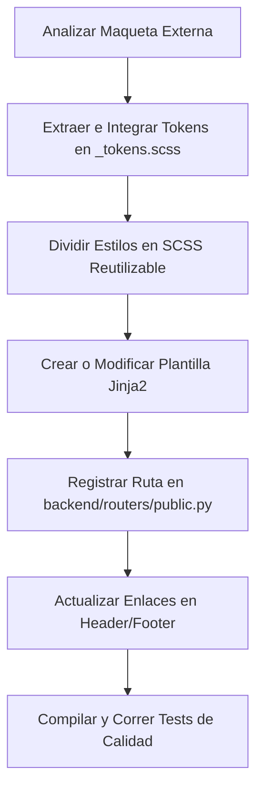

# Guía de Desarrollo Visual y Adaptación de Plantillas HTML

Esta guía está diseñada para desarrolladores que necesiten crear, modificar o adaptar interfaces visuales a partir de maquetas o prototipos HTML externos en el proyecto **Organización FEM**. 

El objetivo es comprender la arquitectura desacoplada, la compilación de estilos, el ruteo en FastAPI y la herencia de plantillas Jinja2 para trabajar de manera ordenada y segura, evitando romper la lógica de negocio.

---

## 1. Arquitectura del Proyecto de un Vistazo

El proyecto está dividido en dos grandes carpetas en la raíz para separar la lógica de backend del diseño de interfaz:

```text
organizacion-fem/
├── backend/                  # LÓGICA PYTHON (FastAPI)
│   ├── main.py               # Punto de entrada de la aplicación
│   ├── core/
│   │   └── templates.py      # Configuración de Jinja2
│   └── routers/
│       └── public.py         # Controladores de rutas públicas (renderizado)
├── frontend/                 # INTERFAZ Y ESTILOS (HTML / SCSS / JS)
│   ├── css/                  # CSS COMPILADO (¡No editar manualmente!)
│   │   └── main.css
│   ├── scss/                 # Código fuente de estilos (Sass)
│   │   ├── _tokens.scss      # Colores, tipografías y sombras
│   │   ├── _base.scss        # Reglas básicas y resets
│   │   ├── _layout.scss      # Estructura (Header, Footer, Grid)
│   │   ├── _components.scss  # Botones, tarjetas, formularios
│   │   ├── main.scss         # Punto de compilación de Sass
│   │   └── pages/            # Estilos específicos de cada página
│   ├── templates/            # Plantillas Jinja2 (HTML desglosado)
│   │   ├── base.html         # Cascarón global
│   │   ├── *.html            # Vistas individuales (index, colegios, etc.)
│   │   └── partials/         # Fragmentos repetitivos (header, footer)
│   └── img/                  # Imágenes, logotipos y assets visuales
├── package.json              # Scripts de compilación de Sass
└── tests/                    # Pruebas automatizadas (pytest)
```

---

## 2. Cómo se Relacionan Backend y Frontend

### A. El Montaje de Archivos Estáticos
En [backend/main.py](organizacion-fem/backend/main.py) se monta la carpeta `/frontend` bajo la ruta URL `/static`:
```python
app.mount("/static", StaticFiles(directory="frontend"), name="static")
```
Esto significa que en tus archivos HTML, cualquier referencia a `/static/` buscará físicamente dentro de la carpeta `frontend/`. Por ejemplo:
*   `frontend/css/main.css` se carga como `{{ url_for('static', path='css/main.css') }}`.
*   `frontend/img/logo-fem-color.png` se carga como `{{ url_for('static', path='img/logo-fem-color.png') }}`.

### B. El Renderizador de Plantillas Jinja2
En [backend/core/templates.py](Apps/organizacion-fem/backend/core/templates.py) se define el directorio de HTMLs en `frontend/templates`. Los routers de FastAPI toman estas plantillas y las sirven inyectando variables dinámicas si es necesario.

---

## 3. Flujo de Trabajo: Cómo Adaptar una Plantilla HTML Externa

Cuando recibes un archivo de diseño (por ejemplo, un prototipo monolítico como `docs/prototipos/home_prototype.html`), **NUNCA** debes copiar y pegar el archivo completo. Debes seguir este proceso ordenado:



### Paso 1: Analizar e Identificar Elementos Clave
Antes de escribir código, abre la maqueta externa y responde a esto:
*   ¿Qué tipografías usa? (¿Están cargadas en `base.html`?).
*   ¿Cuáles son sus colores y sombras? (Variables a definir).
*   ¿Qué partes se repiten? (Deberían ser partials o componentes).
*   ¿Qué lógica interactiva de JavaScript contiene? (¿Es requerida o experimental?).

### Paso 2: Configurar los Tokens de Diseño (`_tokens.scss`)
Abre [frontend/scss/_tokens.scss](file:/organizacion-fem/frontend/scss/_tokens.scss). Si el prototipo tiene colores nuevos, agrégalos como variables o propiedades CSS en `:root`:
```scss
// Ejemplo: Colores y Fuentes del Lema 2026
--color-azul-catedral: #0C1E36;
--color-coral: #F16536;

--font-display: 'Lora', serif;
--font-brand-condensed: 'Barlow', sans-serif;
```

### Paso 3: Modularizar y Escribir el SCSS
Divide el bloque de CSS embebido o el stylesheet del prototipo en los archivos correspondientes:
1.  **Componentes (`_components.scss`)**: Botones (`.btn-primary`), tarjetas (`.card`), formularios, inputs.
2.  **Estructura (`_layout.scss`)**: Rediseño del header (`.main-header`), pie de página (`.main-footer`) y rejillas globales.
3.  **Vistas específicas (`pages/_home.scss`, etc.)**: Reglas que solo aplican a una página en particular.

> [!IMPORTANT]
> **Prohibido Editar `frontend/css/main.css`**: Este archivo es autogenerado. Si realizas cambios en él, se borrarán la próxima vez que compiles. Siempre debes modificar los archivos `.scss` en `frontend/scss/`.

Para compilar tus cambios de Sass a CSS real, ejecuta en tu terminal:
```bash
npm run build:css
```
Si deseas que el compilador escuche tus cambios y los aplique en tiempo real mientras editas, ejecuta:
```bash
npm run watch:css
```

### Paso 4: Construir la Plantilla Jinja2
Las páginas del sitio no son documentos HTML completos. Todas heredan del archivo base común [frontend/templates/base.html](file:/organizacion-fem/frontend/templates/base.html) que ya contiene el `<head>`, la inclusión de estilos, el navbar, el footer y los scripts globales.

Para crear una página nueva (por ejemplo, `mision.html`), usa esta estructura:
```html



Misión y Visión | Organización FEM


<section class="page-hero">
    <div class="container">
        <span class="eyebrow">Ejes Rectores</span>
        <h1 class="page-title">Misión y Visión</h1>
        <p class="page-subtitle">El propósito que guía nuestro accionar.</p>
    </div>
</section>

<section class="home-section">
    <div class="container">
        <!-- Contenido principal extraído de la maqueta -->
    </div>
</section>

```

### Paso 5: Registrar la Ruta en FastAPI
Una vez que el archivo HTML existe en `frontend/templates/`, avísale a Python para que lo sirva al usuario.
Abre [backend/routers/public.py]:///organizacion-fem/backend/routers/public.py y agrega la función decorada con `@router.get`:
```python
@router.get("/mision", response_class=HTMLResponse)
async def mision(request: Request):
    """
    Ruta para la página de Misión y Visión de la institución.
    """
    return templates.TemplateResponse(
        request=request,
        name="mision.html",
        context={"active_page": "mision"}  # Ayuda a resaltar la pestaña activa en el menú
    )
```

### Paso 6: Actualizar los Enlaces de Navegación
Ve a [header.html](organizacion-fem/frontend/templates/partials/header.html) y [footer.html](organizacion-fem/frontend/templates/partials/footer.html) e integra la nueva URL absoluta:
```html
<li class="nav-item">
    <a href="/mision" class="nav-link active">Misión</a>
</li>
```

### Paso 7: Validar la Calidad del Código (Testing)
Nunca envíes un cambio a producción sin validar que el servidor inicie correctamente y que todas las rutas respondan.

1.  Asegúrate de que no haya errores de compilación SCSS.
2.  Abre [tests/test_main.py](organizacion-fem/tests/test_main.py) y escribe una pequeña prueba unitaria para verificar que tu página carga bien:
    ```python
    def test_read_mision():
        response = client.get("/mision")
        assert response.status_code == 200
        assert "Misión" in response.text
    ```
3.  Ejecuta las pruebas en tu terminal usando el entorno virtual:
    ```bash
    PYTHONPATH=. ./venv/bin/pytest
    ```

---

## 4. Reglas de Oro del Desarrollador Junior (Checklist de Seguridad)

- [ ] **Herencia Estricta**: ¿Tu HTML comienza con ``? No incluyas etiquetas `<html>`, `<head>` o `<body>` dentro de las páginas hijas.
- [ ] **Variables y Clases**: ¿Utilizaste variables de `_tokens.scss` para los nuevos colores? Evita hardcodear colores hexadecimales directos en el SCSS.
- [ ] **No usar CSS Embebido**: ¿Removiste todas las etiquetas `<style>` dentro de tu HTML y las llevaste al archivo SCSS correspondiente?
- [ ] **Rutas Absolutas en Menús**: Asegúrate de no utilizar anclas directas sueltas como `href="#identidad"`. Utiliza siempre rutas absolutas como `href="/identidad"` para que la navegación funcione estando en cualquier página.
- [ ] **Manejo de JavaScript**: No pegues scripts dinámicos embebidos en el HTML. Si necesitas interactividad básica, añádela de forma modular en `frontend/js/main.js` o mediante eventos estructurados.
- [ ] **Tests al Día**: ¿Agregaste el caso de test en `test_main.py` y corriste `pytest` exitosamente?
